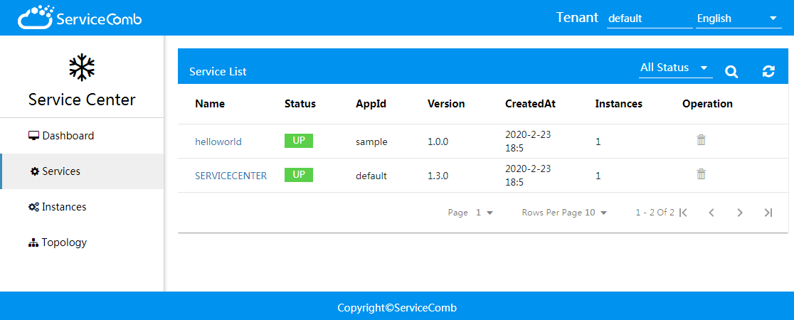

# Develop the first microservice

## Preparement

Before developing the first Java-Chassis microservice, please make sure that your local development environment is prepared. See more details about this in [Prepare the local development environment](./development-environment.md).

The Apache Service Center is needed in this show case. About using service center, please refer to [Install of ServiceCenter](http://servicecomb.apache.org/docs/products/service-center/install/).

## Develop a HelloWorld microservice

### pom configurations

First, please to create an empty maven project. It is suggested that the dependencies should be managed by `dependencyManagement` item, so that only the `solution-basic` is needed to be imported as dependency:
```xml
<dependencyManagement>
  <dependencies>
    <dependency>
      <groupId>org.apache.servicecomb</groupId>
      <artifactId>java-chassis-dependencies</artifactId>
      <version>${java-chassis-dependencies.version}</version>
      <type>pom</type>
      <scope>import</scope>
    </dependency>
  </dependencies>
</dependencyManagement>
<dependencies>
  <dependency>
    <groupId>org.apache.servicecomb</groupId>
    <artifactId>solution-basic</artifactId>
  </dependency>
</dependencies>
```
`solution-basic` has contains almost all of the dependencies you need in the common cases.

For the version 2.0.0 Java-Chassis, `maven-compiler-plugin` compilation plugin is also needed, which can make the method argument names preserved during the source project is build into a jar file.
```xml
<build>
  <plugins>
    <plugin>
      <groupId>org.apache.maven.plugins</groupId>
      <artifactId>maven-compiler-plugin</artifactId>
      <version>3.1</version>
      <configuration>
        <compilerArgument>-parameters</compilerArgument>
        <encoding>UTF-8</encoding>
        <source>1.8</source>
        <target>1.8</target>
      </configuration>
    </plugin>
  </plugins>
</build>
```

### add microservice configurations

By default, Java-Chassis read configurations from the file named `microservice.yaml` placed in `resources` directory.

The content of the file is like below.
```yaml
APPLICATION_ID: sample    # this microservice belongs to the sample application
service_description:
  name: helloworld        # this microservice is named "helloworld"
  version: 1.0.0
servicecomb:
  service:
    registry:
      address: http://127.0.0.1:30100  # this address of the service center
  rest:
    address: 0.0.0.0:8080
```

### Main class

Add a main class in the project:
```java
package org.apache.servicecomb.samples;

import org.apache.servicecomb.foundation.common.utils.BeanUtils;

public class AppMain {
  public static void main(String[] args) {
    BeanUtils.init();
  }
}
```

Invoking the `org.apache.servicecomb.foundation.common.utils.BeanUtils#init()` method will trigger the boot up procedure including configuration loading, Spring application context loading, microservice registration.

### Write a REST service interface

Add a REST service interface class to declare the request you want to handle.
```java
package org.apache.servicecomb.samples.service;

import org.apache.servicecomb.provider.rest.common.RestSchema;
import org.springframework.web.bind.annotation.GetMapping;
import org.springframework.web.bind.annotation.RequestMapping;

@RestSchema(schemaId = "hello")
@RequestMapping("/")
public class HelloWorldService {
  @GetMapping("/hello")
  public String hello() {
    return "Hello world!";
  }
}
```

### Add log configuration

The `solution-basic` module introduces the `log4j2` module. To enable it, a configuration file is needed. This file should be placed in `resources\log4j2.xml` and the content is like below:
```xml
<?xml version="1.0" encoding="UTF-8"?>
<Configuration status="WARN">
  <Appenders>
    <Console name="Console" target="SYSTEM_OUT">
      <PatternLayout pattern="%d{HH:mm:ss.SSS} [%t] %-5level %logger{36}[%L] - %msg%n"/>
    </Console>
  </Appenders>
  <Loggers>
    <Root level="info">
      <AppenderRef ref="Console"/>
    </Root>
  </Loggers>
</Configuration>
```

### Start the microservice

After completing the work above, the microservice can be started by running the `AppMain` class. Please visit the web page of local service center `http://127.0.0.1:30103/`. If the helloworld microservice instance is found like below, the microservice is started successfully.


If you visit the address `http://127.0.0.1:8080/hello`, you can see the response `"Hello world!"` from helloworld service. Now, your first Java-Chassis microservice is completed!.

## Additional

The introduction demo is developed in Spring MVC style.
And there are currently 3 ways to choose:

* Spring MVC
* JaxRS
* RPC

Developers can quickly build a project in following ways:

* Download the samples project. [servicecomb-samples](https://github.com/apache/servicecomb-samples) provides many samples in hand.

  * [Spring MVC Sample](https://github.com/apache/servicecomb-samples/tree/master/java-chassis-samples/springmvc-sample)
  * [JaxRS Sample](https://github.com/apache/servicecomb-samples/tree/master/java-chassis-samples/jaxrs-sample)
  * [POJO Sample](https://github.com/apache/servicecomb-samples/tree/master/java-chassis-samples/pojo-sample)

* Generate projects using archetypes

  Maven provide archetypes to generate projects. Java-chassis implements many types of archetypes, see [LINK](https://github.com/apache/servicecomb-java-chassis/tree/master/archetypes) for details.

* Generate projects using ServiceComb Spring Initializer

  ServiceComb Spring Initializer is an graphic user interface to generate projects. See [LINK](http://start.servicecomb.io/)
