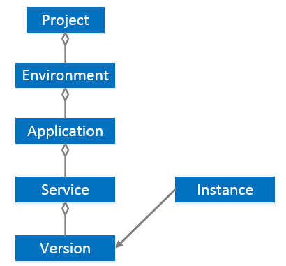
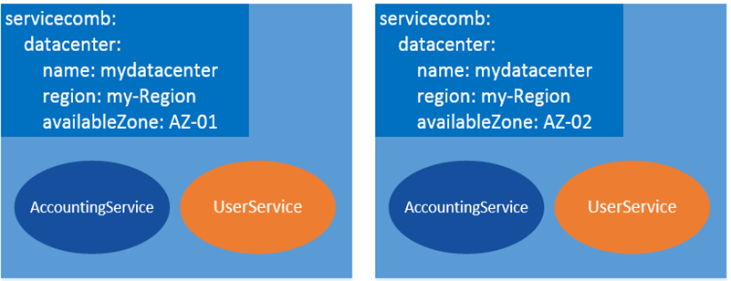

# 微服务实例间多环境隔离

进行服务发现的时候，开发者需要了解本微服务能够发现那些其他服务的实例。ServiceComb提供了分层次的实例隔离。

# 微服务实例分层管理

要了解实例间的隔离层次，首先需要了解ServiceComb定义的一个体系完备的微服务系统结构：



在微服务系统结构中，顶层是项目（project），项目中的应用分属于不同环境（environment），即测试和生产环境可以分开，每个环境下包含多个应用（application），在某个特定应用的特定环境中，包含多个微服务（service），一个微服务又可以同时存在多个版本（version）。  
以上，是所有静态元数据的范畴，某个特定服务的特定版本则包含多个在运行时注册上来的微服务实例，因为服务实例的信息在运行时随着系统的伸缩、故障等原因是动态变化的，所以服务实例的路由信息又为动态数据。通过分层管理微服务的这些数据，也就自然而然地实现了实例之间的逻辑隔离。
* Project对应到华为云上各region下创建的project，不同的project互相隔离，如果该region下没有新建project，则代表该region；例如，在华北区（cn-north-1）下创建一个名字为tianjing的project，若想微服务注册到该project下，可以在microservice.yaml文件里配置：
```yaml
  servicecomb:
    credentials:
      project: cn-north-1_tianjing
```
* Environment表示当前微服务实例所属环境，可在microservice.yaml文件里通过service_description.environment配置当前实例环境。

* Application代表一个软件应用的逻辑实体，表示一个有业务功能呈现给用户的计算机软件应用，可在microservice.yaml文件里通过APPLICATION_ID配置应用名。

* Service是对按需取用的功能对象的一种描述，一个应用下存在多个服务，各服务间相互调用，可在microservice.yaml文件里通过service_description.name指定服务名。

* Version表示当前服务的版本，一个服务下可存在多个版本，可在microservice.yaml文件里通过service_description.version配置当前微服务版本号；消费端进行访问时，默认按照路由规则进行访问，可以在消费端通过servicecomb.references.[providerName].version-rule设置版本规则。

# 典型场景
## 应用间隔离及跨应用调用
### 功能介绍
在ServiceComb框架中，一个应用下包含多个微服务。  
同一个微服务实例，可以作为公共服务部署到多个应用，通过指定不同的APPLICATION_ID来实现。


不同的微服务实例，默认情况下，只允许在同一个应用里相互调用，当用户需要不同应用间的微服务相互调用时，就需要开启跨应用调用功能。  
### 配置说明：
1. 若要开启跨应用调用，首先需在provider端的microservice.yaml文件开启跨应用调用配置。配置项如下：
```yaml
    service_description:
      properties:
        allowCrossApp: true
```
2. Consumer端指定微服务名称调用provider的时候，需要加上provider所属的应用ID，格式由[microserviceName]变为[appID]:[microserviceName]。

### 代码示例：
假设consumer所属应用为helloApp，provider所属应用为hellApp2，微服务名称为helloProvider。  
* RestTemplate调用方式  
当consumer端以RestTemplate方式开发微服务消费者时，需要在调用的URL中将[microserviceName]改为[appID]:[microserviceName]，如下：
```java
RestTemplate restTemplate = RestTemplateBuilder.create();
ResponseEntity<String> responseEntity = restTemplate.getForEntity(“cse://helloApp2:helloProvider/hello/sayHello?name={name}”, String.class, “ServiceComb”);
```
* RPC调用方式  
当consumer端以RPC方式开发微服务消费者时，声明的服务提供者代理如下：
```java
@RpcReference(schemaId = “hello”, microserviceName = “helloApp2:helloProvider”)
private Hello hello;
```
跨应用调用与同应用下调用微服务的方式相同：
```java
hello.sayHello(“ServiceComb”);
```

# 典型场景
## 开发环境互相隔离及快速开发
### 功能介绍
ServiceComb框架通过设置environment，可以将微服务实例标记为开发、测试、预生产、生产环境，实现了在实例级别的天然隔离；客户端在查找服务端实例的时候，只能发现相同environment下的服务端实例。


ServiceComb在设计时，严格依赖于契约，所以正常情况下契约变了，就必须要修改微服务的版本。但是如果当前还是开发模式，那么修改接口就是很正常的情况，当修改完毕再次启动当前服务时，新生成的契约和Service Center上保存的旧契约会冲突并报错，导致启动失败，如果每次都通过修改微服务版本号，或者删除该服务在Service Center上的缓存数据来解决，显然对开发人员很不友好。  
ServiceComb框架支持在开发态进行微服务的快速调试，通过将environment配置为development即可。当接口修改了（Schema发生了变化），重启就可以正常注册到服务中心，而不用修改版本号。  
但是如果有consumer已经调用了重启之前的服务，那么consumer端也需要重启才能获取最新provider的schema；比如A->B，B接口进行了修改并且重启，那么A这个时候还是使用B之前的schema，调用可能会出错，以免出现未知异常，A也需要重启。  
### 配置说明：
仅支持以下枚举值：development,testing,acceptance,production，不配置的情况下缺省值为""（空）。  
* 方法1：通过JVM启动参数-Dservice_description.environment=development（枚举值）进行设置；  
* 方法2：通过microservice.yaml配置文件来指定：
```yaml
  service_description:
    environment: development
```
* 方法3：通过环境变量SERVICECOMB_ENV来指定（仅限于windows系统），若是开发态，其值配置为development；

# 典型场景
## 两地三中心
### 功能介绍
在以两地三中心的解决方案进行跨地区部署服务的场景，同一套服务存在于多个availableZone中，需要实现优先调用同一个AZ内的应用，若本AZ出现问题，要能够访问另一个AZ下的应用，从而保证服务的可靠性。  
ServiceComb提供了数据中心配置，来实现对微服务的分区和管理。数据中心包含3个属性：servicecomb.datacenter.name, servicecomb.datacenter.region, servicecomb.datacenter.availableZone，数据中心信息不提供隔离能力，微服务可以发现其他数据中心的实例。但是可以通过启用实例亲和性，来优先往指定的区域或者Zone发消息。



客户端在路由的时候，会优先将请求转发到zone/region都相同的实例，然后是region相同，但zone不相同的实例，都不相同的时候，则按照路由规则选择一个。亲和性不是逻辑隔离，只要实例之间网络是联通的，那么都有可能访问到；如果网络不通，则会访问失败。  
在华为云上部署时，可将region和availableZone的值与华为云的region（例如：cn-north-1）和可用区对应起来，但是因为华为云上的不同region目前网络不互通，所以此时不支持跨region访问；除了对应华为云的region值，也可以自行定义其他值，根据实际情况作相应调整，非常灵活。  
### 配置说明：
```yaml
servicecomb:
  datacenter:
    name: mydatacenter
    region: my-Region
    availableZone: my-Zone
```
