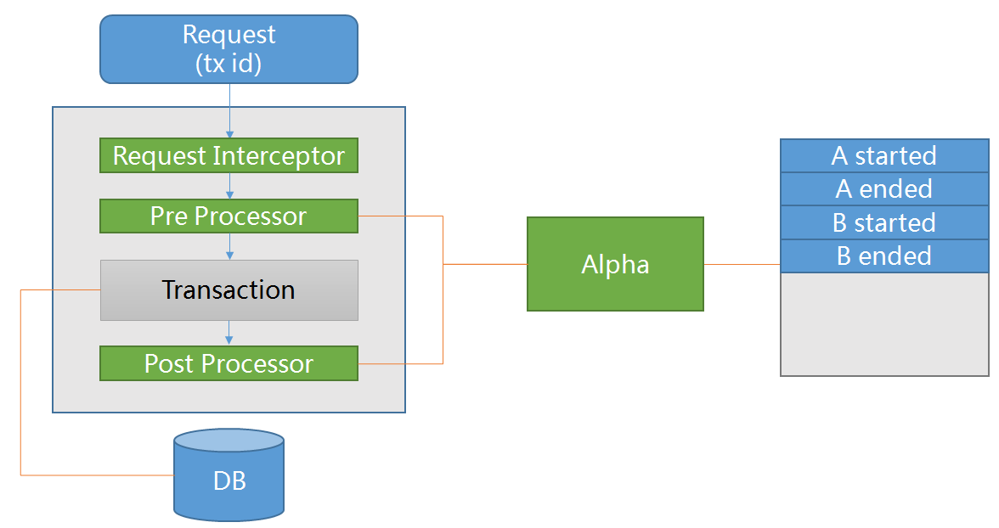
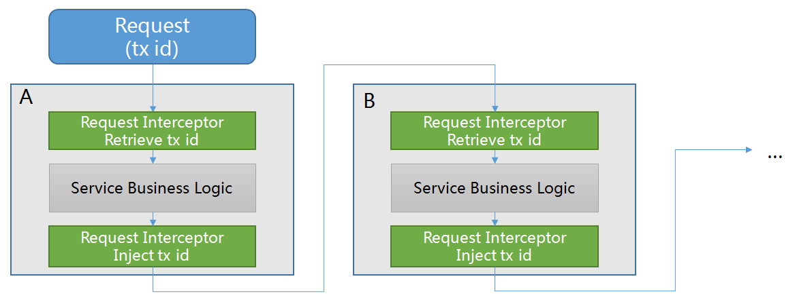
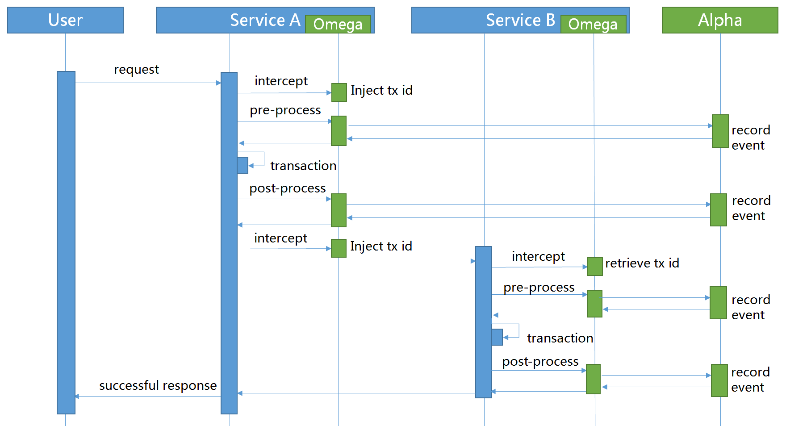
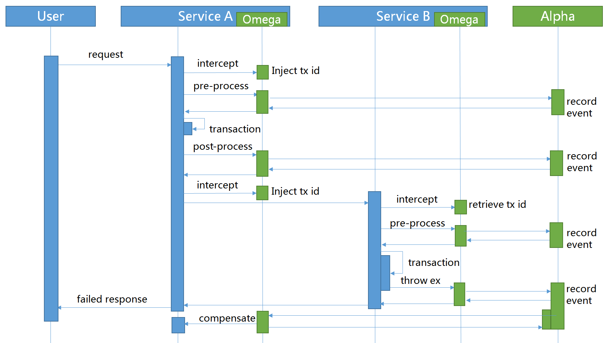
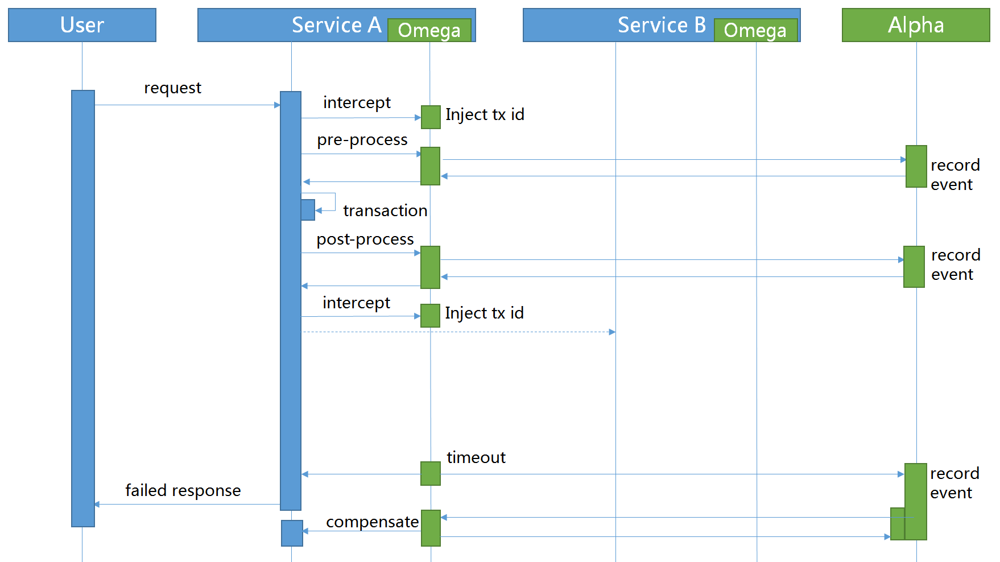
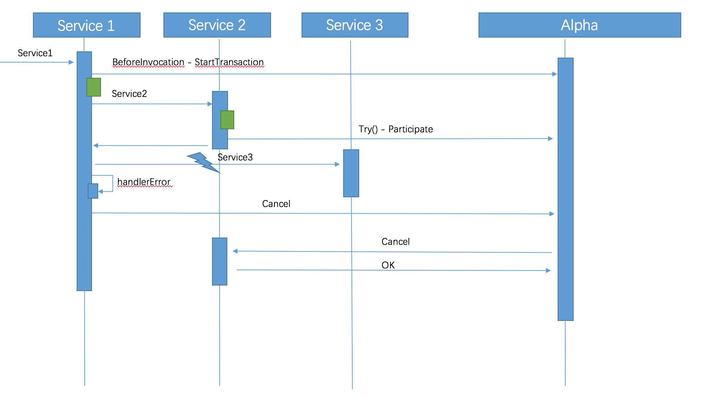

# Saga Pack Design
## Overview
Pack contains two components: *alpha* and *omega*. Alpha is the pack leader and backed by database to make sure transaction events stored permanently while omega is the pack worker and embedded inside services to intercept transaction invocation and report events to alpha.

## Omega Internal
Omega plays as an embedded agent inside services. When a service request arrives, omega intercepts its header and retrieve the global transaction id as its global transaction id (Saga event id) and retrieve the local transaction id as its parent transaction id. In pre-process phase, a transaction started event will be recorded in alpha. In post-process phase, a transaction ended event will be recorded in alpha to mark the end of the sub-transaction.

## Inter-Service Communication
The process of Inter-Service Communication is similar to [Zipkin](https://github.com/openzipkin/zipkin)'s. In the producer side, omega intercepts the transaction ids from request to retrieve the transaction context. In the consumer side, omega inject the global transaction ids into request to pass the transaction context. Sub-transactions can chain as a single global transaction by co-operating producers and consumers.

## Workflow Saga
In Saga workflow, the sub transactions need to provide the compensation method. If something is wrong, the Coordinator will send the command to the omega to do the forward or backward recovery.

### Successful Scenario
In a successful scenario, all started events will have a corresponding ended event.

### Exception Scenario
In an exception scenario, omega inside the abnormal service will report an aborted event to alpha. Apha will then send compensate commands to the completed events within the global transaction to make sure all sub-transactions are either completed or rollbacked.

### Timeout Scenario
In timeout scenario, timeouted events will be detected by alpha's period scanner, the corresponding global transaction will be abort at the same time.

## Workflow TCC
Comparing Saga, TCC(try-confirm-cancel) just have one more method(try) to check if we have enough resource to finish the transaction.
 The transaction starter knows all the distributed sub transactions status, so it can work with alpha to confirm or cancel the transactions。
### Successful Scenario
In a successful scenario, all try events are confirmed.

### Exception Scenario
In an exception scenario, the starter will send the cancel event to alpha, and alpha could invoke the cancel methods which are registered to the Alpha server to clean up the pre allocated resources.

